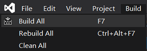

# Cpp_Empty_Project
**Cpp_Empty_Project** 是一个 跨平台的，基于cmake工具的，C++17空项目。你可以以此项目为基础，搭建出自己的 跨平台 C++ 程序。

## 我该下载哪个分支
直接下载 Branch:**master** 即可。

## 此项目支持哪些平台
- **Win10**
- **MacOSX** (10.12 或更高版本) 
- **Ubuntu** (16.04 或更高版本) 

也许可以支持各平台的较早版本，但我尚未测试。

## 支持哪款编译器
**Clang** 是最推荐的编译器，即便是在 **Win10** 平台。
请确保你所下载和安装的 **Clang** 版本，支持 **C++17**。

## 如何安装

### Mac OS X

在 **Mac** 平台的安装非常简单。

首先，确保你已经成功安装如下程序：
- **CMake** (3.1 或更高版本; 若想使用PCH，Unity-builds 技术加速编译，推荐 3.16 或更高版本)
- **Clang** (足以支持 **C++17** 的较新版本)

然后，打开 **终端**（terminal），**"cd"** 至 本项目的根目录： 

    $ cd .../appRootDir/

(注意，此处的 "appRootDir" 应替换为实际的根目录名字) 

接着，运行一份 shell 脚本程序：

    $ ./unix_release.sh

脚本 `unix_release.sh` 将会自动化地帮我们完成程序的 **build** 和本地化部署工作。
你也可以选择运行另一份脚本：`unix_debug.sh`， 正如名字所示，它将生成一份 **DEBUG** 版的程序。

现在，所有的安装工作都已经 **完成** 了!!!

你可以在目录： **.../appRootDir/build/publish/** 中找到可执行文件：**emptyApp**。
双击它，运行我们的程序!!!
(注意，此处的 "appRootDir" 应替换为实际的根目录名字)

### Ubuntu 
在 **Ubuntu** 上的安装与 **Mac OS X** 十分相似。

首先，请确保你已经安装如下程序：

**CMake** (3.1 或更高版本; 若想使用PCH，Unity-builds 技术加速编译，推荐 3.16 或更高版本)：

    $ sudo apt-get install cmake

**Clang** (足以支持 **C++17** 的较新版本)：

    $ sudo apt-get install llvm
    $ sudo apt-get install clang 

重设系统默认的 **C/C++编译器**：

    $ sudo update-alternatives --config c++
    $ sudo update-alternatives --config cc

现在，打开 **终端**（terminal），**"cd"** 至 本项目的根目录： 

    $ cd .../appRootDir/

(注意，此处的 "appRootDir" 应替换为实际的根目录名字)

接着，运行一份 shell 脚本程序：

    $ ./unix_release.sh

脚本 `unix_release.sh` 将会自动化地帮我们完成程序的 **build** 和本地化部署工作。
你也可以选择运行另一份脚本：`unix_debug.sh`， 正如名字所示，它将生存一份 **DEBUG** 版的程序。

现在，所有的安装工作都已经 **完成** 了!!!

你可以在目录： **.../appRootDir/build/publish/** 中找到可执行文件：**emptyApp**。
(注意，此处的 "appRootDir" 应替换为实际的根目录名字)

在 **终端** 中启动它：

    $ build/publish/emptyApp

运行我们的程序!!!

### Win10

为了支持 **Win10** 中的 **Clang**，我们首先要安装 **Visual Studio 2019**。

然后，启动 **Visual Studio 2019**，点选初始界面中的 `Open a local folder` 按钮，在弹出的窗口中，选择本程序的根目录 ->

进入主界面后，选择 **Manage Configurations...** 按钮 ->

在随之而来的 **CMake Settings** 面板中，移除掉已经存在的 **DEBUG** 配置，然后手动选择一份新的配置：**x64-Clang-Release** ->

找到 **Build root** 一览，将其值修改为: `${projectDir}\build` ->
（注意，这一步非常重要，请务必不要遗漏）

在左侧的 **Solution Explorer** 面板中，右键单击文件：`CMakeLists.txt`，在弹出的下拉菜单中选择：`Generate Cache for cppEmptyProject` ->

这将帮助我们生成 cmake Cache 数据。
等待片刻，直到下方 **Output** 面板中出现 `CMake generation finished.` 信息。
这表示 cmake Cache 生成成功。

紧接着。在 **Visual Studio 2019** 左上方的 `Build` 菜单中，找到 `Build All` 按钮，点击它，开始正式的 **Build** 工作。（也可以使用快捷键:`F7`） ->

**Build** 工作 将会持续数分钟，直到我们在下方的 **Output** 面板中看到 `Build All succeeded.` 的信息。这表示，**Build** 成功。我们在 **Visual Studio 2019**
中的工作就全部结束了。

最后的最后，回到本项目所在的根目录。寻找并双击一份名为 `win.bat` 的脚本文件。
它将帮助我们执行本地化部署工作。
比如将一些 根目录下的 资源性目录（如 “shaders”,"jsons" 复制到 <root>/build/publish/ 目录下）
这个过程可能非常快，一闪而过。别担心，它已经运行了。如果你不放心，可以再次双击一遍。

现在，安装正式**完成**!!!

你可以在目录 **.../appRootDir/build/publish/** 中，找到可执行文件 **emptyApp.exe**，
它就是我们的程序本体。
(注意，此处的 "appRootDir" 应替换为实际的根目录名字)

由于这个程序的 main() 函数中，暂时只有一些 命令行打印函数。如果直接双击运行此 .exe 程序，它可能只会闪出一个命令框，然后立马结束。
为了有效测试程序，你还可以将这个 .exe 文件，拖动到一个 命令行窗口中，然后按下回车键来启动程序。如果一切正常，命令行窗口会打印如下信息：

# 使用方式
接下来，我们将介绍，如何使用这个空项目，来组建自己的项目。
编写中...

## 版权协议遵守 [BSD 3-Clause](LICENSE)

## 欢迎反馈与建议
本程序的初衷是为了帮助大家，更便捷地搭建 C++项目。由于我也是爱好者，水平有限，这个项目还存在一些不足。比方说，这个项目似乎更适合 Mac/Linux 平台的开发者，对于 Win 开发者来说，它的调试和编译过程都有点繁琐。
此外，它的 cmake 文件写得也很业余。这方面欢迎高玩改进。

如果您有任何反馈或建议，都可以通过下方联系方式联系开发者本人。
*   E-mail: [turesnake@gmail.com](mailto:turesnake@gmail.com)
*   E-mail: [turesnake@icloud.com](mailto:turesnake@icloud.com)
*   QQ: 651700603

